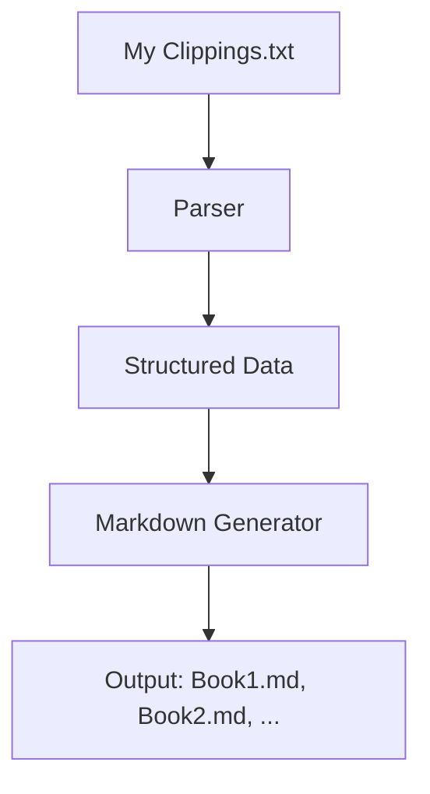

# Kindle2MD: Autonomous Kindle Clippings to Markdown Converter

An autonomous, open-source CLI tool to convert Kindle "My Clippings.txt" into structured Markdown notes with highlights, annotations, and metadata.

## Features
- Parses Kindle `My Clippings.txt` into structured data.
- Outputs clean Markdown files (one per book).
- Supports highlights, notes, and bookmarks.
- Autonomous: No manual setup required.
- Self-documenting: Reproducible examples and architecture.
- Extensible: Custom output formats via templates.
- Multi-language support: Works with English, Chinese, Japanese, and other languages.

## Technical Architecture


## Installation
```bash
# Clone the repository
git clone https://github.com/femirins/kindle2md.git
cd kindle2md

# Install dependencies (if any)
pip install -r requirements.txt
```

## Usage
```bash
# Convert clippings to Markdown
python3 kindle2md.py "My Clippings.txt" output_dir

# Example
python3 kindle2md.py test_clippings.txt output
```

## Example Output
### Input (`My Clippings.txt`)
```text
The Pragmatic Programmer (Andrew Hunt, David Thomas)
- Your Highlight on Location 123-124 | Added on Monday, May 25, 2026, 10:00:00 AM

The most damaging phrase in the language is “We’ve always done it this way!”
==========
```

### Output (`The Pragmatic Programmer.md`)
```markdown
# The Pragmatic Programmer
**Author**: Andrew Hunt, David Thomas

---

> The most damaging phrase in the language is “We’ve always done it this way!”

- *Location*: 123-124 | *Added on*: Monday, May 25, 2026, 10:00:00 AM
```

## Testing
```bash
# Run the test suite
python3 -m unittest discover
```

## License
MIT## Note
This repository was published under "" due to GitHub namespace restrictions. A transfer to "femirins" is pending.

To request a transfer, open an issue in this repository or contact `@femirins` on GitHub.
## Note
This repository was published under `fairyfemirins` due to GitHub namespace restrictions. A transfer to `femirins` is pending.

To request a transfer, open an issue in this repository or contact `@femirins` on GitHub.

Alternatively, manually request a transfer via the GitHub web UI:
1. Navigate to [https://github.com/fairyfemirins/kindle2md/settings](https://github.com/fairyfemirins/kindle2md/settings).
2. Under "Danger Zone", select "Transfer ownership".
3. Enter the target namespace (`femirins`) and confirm.
